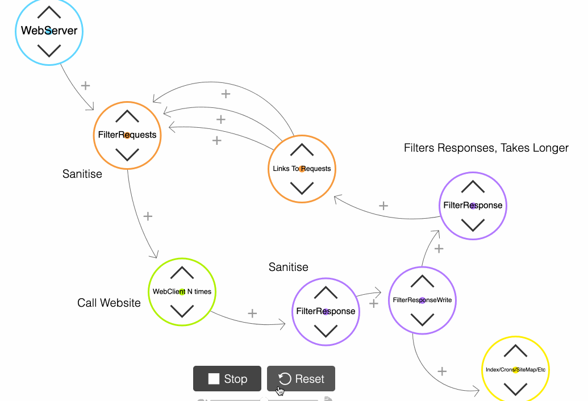

## Intro
Thank you for the opportunity to do this exercise! Don't have much Go experience but trying my best !

[](https://goreportcard.com/report/github.com/goncalopereira/gocrawler)

[](https://godoc.org/github.com/goncalopereira/gocrawler/internal/crawler)

[](https://travis-ci.org/goncalocool/coolcoolcool)

[Code Coverage](https://goncalocool.github.io/coolcoolcool/)

Code is sitting in a Github account I created to host this publicly outside my profile.

```go get github.com/goncalopereira/gocrawler/cmd/crawler```



## Run

### local run/test

```./scripts/run.local.sh```  Includes -race flag

```./scripts/run.local.norace.sh``` 

```./scripts/test.local.sh``` 

```docker run --rm -i hadolint/hadolint < ./build/Dockerfile```

#### Production/test like Docker
```./scripts/run.docker.sh```

```./scripts/test.docker.sh```

#### Production like Minikube
```./scripts/run.minikube.sh```

## Results
Test string:
```curl --data-urlencode "url=https://www.monzo.com" http://localhost:8080```

At monzo.com with full depth you'll around 940 unique nodes in 30/40seconds, in the (Stdout is default) output.csv there is:
- An ordered list of priority (number of pages linking in/pseudo page ranking)
- A Breadth First Search display of all pages starting on the 'heaviest page' according to the previous ranking (starting domain)

Service will respect ENV settings, it will crawl one external request at a time and queue remaining external ones. 

SIGTERM will try to wait for crawl to end for a graceful shutdown.

TravisCI Build available (see badge) as well as Containers.

## Original 
We'd like you to write a simple web crawler in a programming language of your choice. Feel free to either choose one you're very familiar with or, if you'd like to learn some Go, you can also make this your first Go program! The crawler should be limited to one domain - so when you start with https://monzo.com/, it would crawl all pages within monzo.com, but not follow external links, for example to the Facebook and Twitter accounts. Given a URL, it should print a simple site map, showing the links between pages.

Ideally, write it as you would a production piece of code. Bonus points for tests and making it as fast as possible!

## Requirements
- Simple Web Crawler
- Optional language
- Limited to one domain (? include subdomains if following links?) - Not include external links like Twitter, Facebook
- Simple Site Map
- Production ready
- Tests

## Approach
- Web Crawler specifications [W3][W3 Write Web Crawler], [robots.txt][robots.txt]
- Find competing products [Wget-Mirror], [Scrapy], [Apache-Nutch]
- RFC 🤷‍
  
## Summary of characteristics in Web Crawlers
- Respect HTTP Cache Headers as If-Modified-Since, Last-Modified
- Identify using User-Agent
- Respect robots.txt - At least 1s delay between queries, obey Crawl-Delay

## Some characteristics in other products
- [X] Depth
- [ ] Partition URLs 
- [ ] Rotate User-Agent (Bad)
- [ ] Disable cookies (Bad)
- [ ] Download Delay (Mentioned in robots.txt)
- [X] Skip existing URLs
- [X] Normalised URL
- [X] URL filters
- [X] Fetch if required
- [ ] Parse batches
- [ ] Data source Scoring
- [ ] Stop when reaches max urls
- [X] Output

## Some externally bound concerns (bottlenecks, failures)
- Web Requests to site
- DNS lookups
- Write AND/OR indexing
- Storage model
- Map creation 

## Some Golang info I looked at whilst developing this
- [Best Practices][Best Practices]
- [Advanced Testing][Advanced Testing]
- [Concurrency Patterns][Concurrency Patterns]
- [Naming][Naming]
- [Project Structure][Project Structure]
- [Awesome Go][Awesome Go]
- [Golang Net/HTTP][Golang Net/HTTP]

## Decisions for Production and Testing
- [Separate build containers][MultiStage]
- [12 factor][12 factor]
- [Best Practices For Industrial Programming][Best Practices For Industrial Programming]

[W3 Write Web Crawler]: https://www.w3.org/wiki/Write_Web_Crawler
[robots.txt]: http://www.robotstxt.org/robotstxt.html
[Sitemap-Protocol]: https://www.sitemaps.org/protocol.html
[Best Practices]: https://talks.golang.org/2013/bestpractices.slide#1
[Advanced Testing]: https://www.youtube.com/watch?reload=9&v=yszygk1cpEc
[Concurrency Patterns]: https://www.youtube.com/watch?v=YEKjSzIwAdA
[12 factor]: https://12factor.net/
[MultiStage]: https://docs.docker.com/develop/develop-images/multistage-build/
[Wget-Mirror]: https://www.gnu.org/software/wget/manual/html_node/Recursive-Retrieval-Options.html
[Scrapy]: https://scrapy.org/
[Apache-Nutch]: https://nutch.apache.org/
[Naming]: https://talks.golang.org/2014/names.slide
[Best Practices for industrial programming]: https://www.youtube.com/watch?v=PTE4VJIdHPg
[Project Structure]: https://github.com/golang-standards/project-layout
[Awesome Go]: https://github.com/avelino/awesome-go
[Golang Net/HTTP]: https://blog.cloudflare.com/the-complete-guide-to-golang-net-http-timeouts/